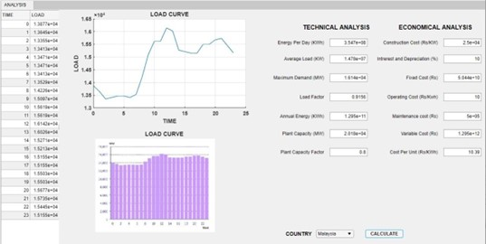
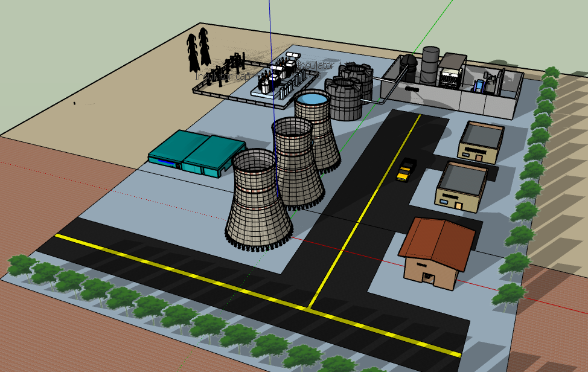
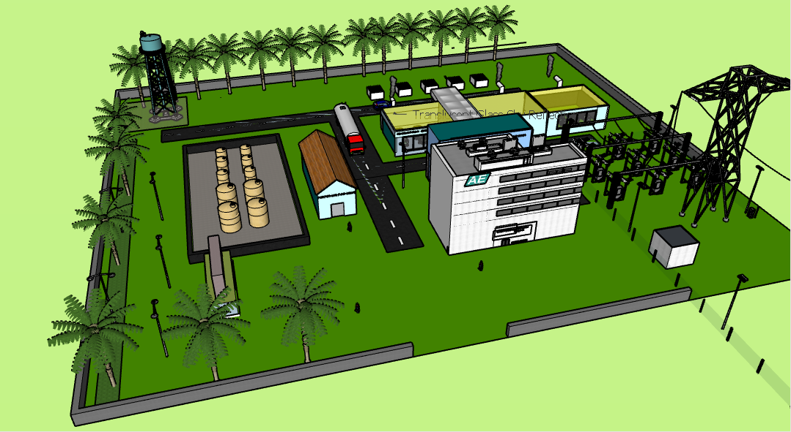

# PG-CEP
Generating station costing and design for load profiles of 6 different countries. Prepared as a Complex Engineering Problem (CEP)-based end-of-semester project for EE-411 Power Generation (Fall 2023) as part of BE-Electrical Engineering at NEDUET.

## Project Report
Details of the project are summarised in the [Project Report](https://github.com/moeed17/PG-CEP/blob/main/PG%20CEP%20Report.pdf).

## Group Members
Ali Aman EE-136

[Hammad Ali Khan EE-139](https://github.com/hammaad2002) 

Syeda Rujab EE-154

[Abdul Moeed EE-170](https://github.com/moeed17)

## Deliverables
MATLAB GUI Application

A GUI application for the technical and economic analysis of 6 real-world load profiles. Built with MATLAB App Designer R2020a.
Loads and plots data for 6 real-world daily load profiles (one at a time).

Allows user to calculate:-

Technical Metrics: load factor, maximum load, base load, average load, units consumed.

Economic Metrics: Overall cost per unit generated (two-part or three-part).

## Proposed Generating Station 3D Models
**Nuclear Station Model**

**Diesel Station Model**

Designed in SketchUp.

**Proposed designs are:**
1. Nuclear Power Station Design
2. Diesel Power Station Design

**Designs account for:**

-Generator dimensions and spacing requirements.

-Transmission yard and relevant equipment.

-Fuel transportation and storage requirements.

-Heat rejection and exhaust systems.
